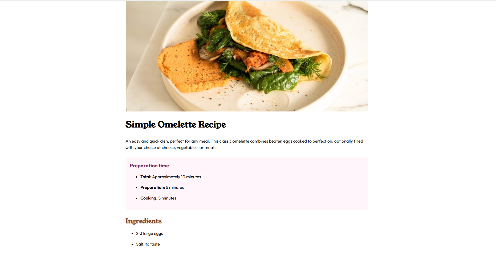

# Frontend Mentor - Recipe page solution

This is a solution to the [Recipe page challenge on Frontend Mentor](https://www.frontendmentor.io/challenges/recipe-page-KiTsR8QQKm). Frontend Mentor challenges help you improve your coding skills by building realistic projects. 

## Table of contents
- [Links](#links)
- [Built with](#built-with)
- [Author](#author)
- [Acknowledgments](#acknowledgments)

## Links

- Solution URL: [github.com/the-ashish-gaikwad/recipe-page-challenge-fm/](https://github.com/the-ashish-gaikwad/recipe-page-challenge-fm/)
- Live Site URL: [https://the-ashish-gaikwad.github.io/recipe-page-challenge-fm/](https://the-ashish-gaikwad.github.io/recipe-page-challenge-fm/)

## Built with

- Semantic HTML5 markup
- Vanilla CSS
- Andy Bell's Modern Reset
- Mobile-first workflow
- self hosting (fonts, images)

## Author

- Frontend Mentor - [@the-ashish-gaikwad](https://www.frontendmentor.io/profile/the-ashish-gaikwad)

## Acknowledgments

A big thank you to Frontend Mentor for their well-organized resources and learning path. It’s a fantastic platform for anyone looking to improve their web development skills through hands-on practice.
